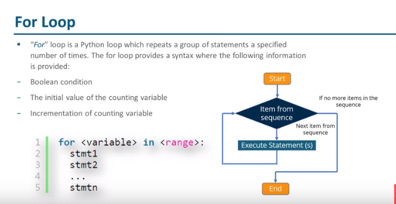
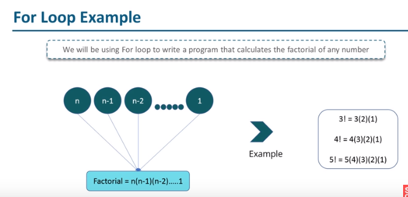

# For Loop

## Definition

- It is a Python loop which repeats a group of statements a specified number of times.  The for loop provides a syntax where the following information is provided
  - Boolean condition
  - The initial value of the counting variable
  - Incrementation of counting variable

## Syntax:

```python
for <variable> in <range>:
    stmt1
    stmt2
    ...
    stmtn
```



## For Loop Example

