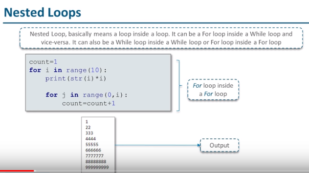
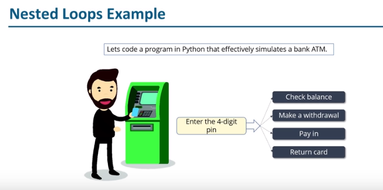

# Nested Loops

## Definition:

- Nested loop basically means a loop inside a loop
- It can be a For loop inside a While loop and vice-versa
- It can also be a While loop inside a While loop or For loop inside a For loop

## Syntax

```python
count = 1
for i in range(10):
    print(str(i) * i)

    for j in range(0, i):
        count = count + 1
```



## Nested Loops Example


