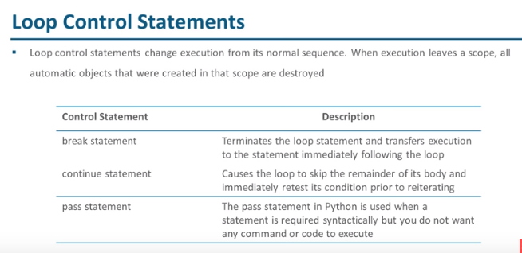

# Loop Control Statements

## Definition

- Loop control statements change execution from its normal sequence
- When execution leaves a scope, all automatic objects that were created in that scope are destroyed

## Loop Control Statements Descriptions

- break statement: Terminates the loop statement and transfers execution to the statement immediately following the loop
- continue statement: Causes the loop to skip the remainder of its body and immediately retest its condition prior to reiterating
- pass statement: The pass statement in Python is used when a statement is required syntactically but you do not want any command or code execute

